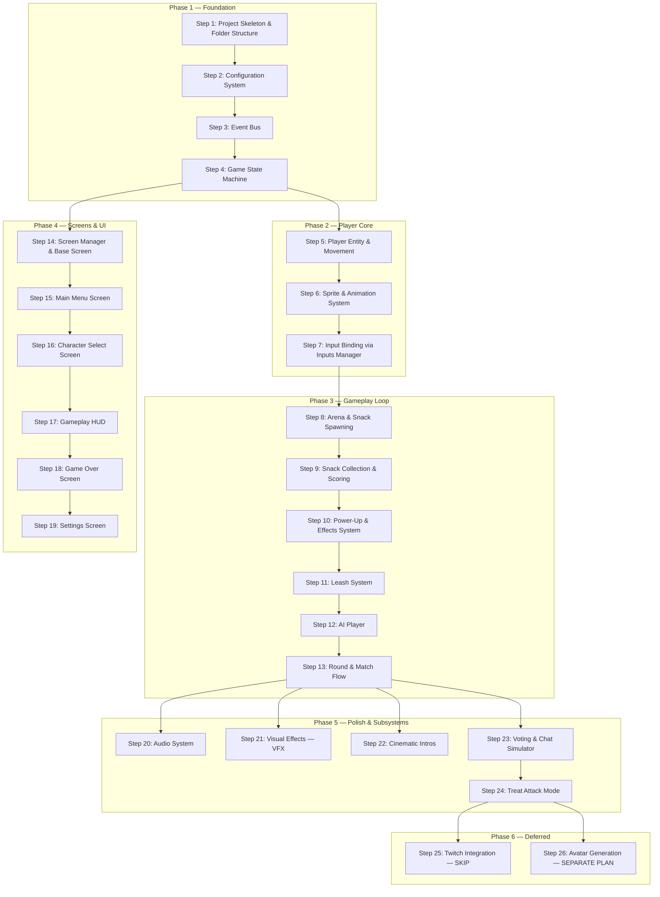
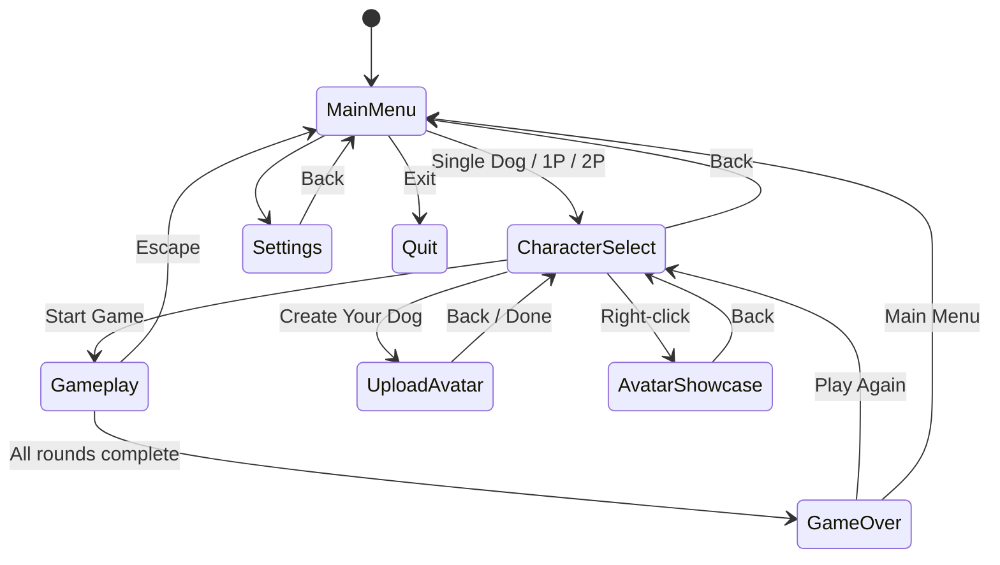
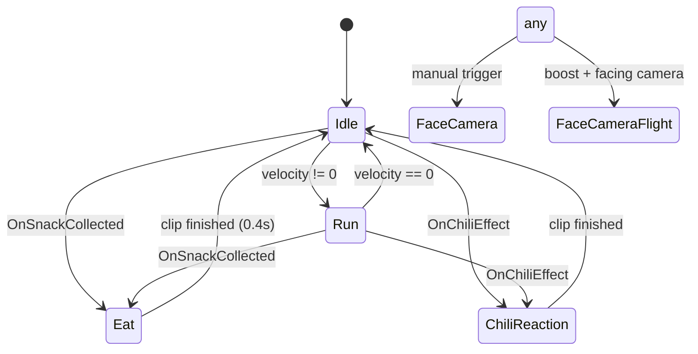
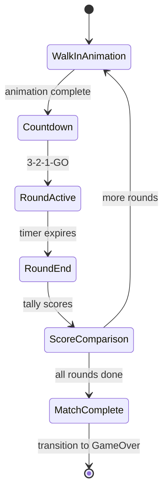
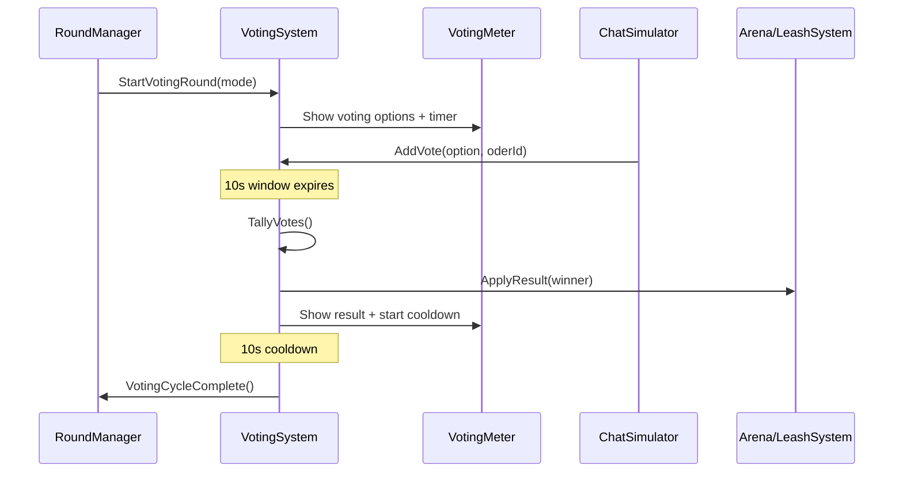
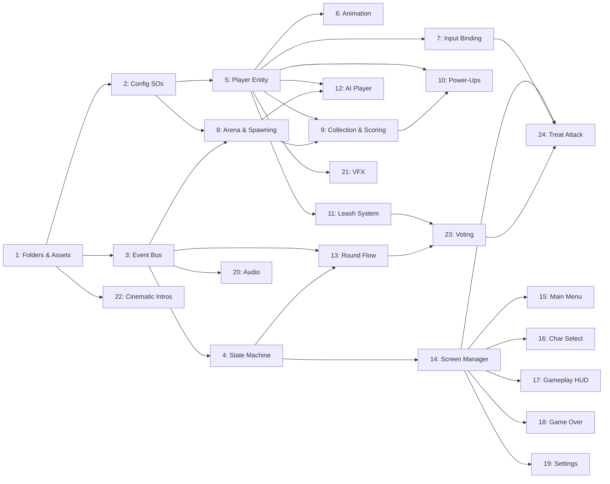

# Snack Attack: PyGame to Unity Conversion Plan

> **Scope**: Convert the PyGame "Jazzy's Treat Storm" project into a Unity 2D game using URP, legacy Canvas UI, and the BxB Inputs Manager. PC-only, local multiplayer.

---

## Architecture Overview

The plan follows a **Core-to-Subsystem** approach. Each step produces a working, testable layer that the next step builds on. Steps are designed to be conflict-free — no two steps modify the same files or systems.



### Key Conventions

| Concern | Decision |
|---------|----------|
| Rendering | URP 2D (already configured) |
| UI | Legacy Canvas + uGUI (`com.unity.ugui 2.0.0`) |
| Input | BxB Inputs Manager (wraps New Input System) |
| Config data | ScriptableObjects (replaces JSON config files) |
| Events | C# event bus (ScriptableObject-based or static singleton) |
| State management | Enum-based state machine MonoBehaviour |
| Scene strategy | Single persistent scene + UI panels toggled by state machine |
| Sprites | Reuse existing PyGame PNGs, imported as Unity Sprites |
| Audio | Unity AudioSource + AudioMixer (replaces pygame.mixer) |
| MCP | Unity MCP tools will be used for implementation (not planning) |

---

## Phase 1 — Foundation

These steps create the core infrastructure that every other system depends on. No gameplay, no visuals — just the skeleton.

---

### Step 1: Project Skeleton & Folder Structure

**Goal**: Establish the Unity project folder hierarchy and import all raw assets from the PyGame project.

**What to create**:

```
Assets/
├── Scenes/
│   └── MainScene.unity              # Single persistent scene
├── Scripts/
│   ├── Core/                        # Event bus, config, state machine
│   ├── Entities/                    # Player, AIPlayer, Snack, etc.
│   ├── Screens/                     # UI screen controllers
│   ├── Audio/                       # Audio manager
│   ├── Effects/                     # VFX, intros
│   ├── Interaction/                 # Voting, Twitch (future)
│   └── Generators/                  # Avatar pipeline (future)
├── ScriptableObjects/
│   ├── Config/                      # Game settings, characters, snacks, etc.
│   └── Events/                      # Event channel assets (if SO-based)
├── Art/
│   ├── Characters/
│   │   ├── SpriteSheets/            # Run, eat, walk, boost sheets per character
│   │   ├── Portraits/               # Profile PNGs
│   │   └── Wings/                   # Wing up/down sprites
│   ├── Food/                        # Snack sprites
│   ├── UI/                          # Backgrounds, buttons, logo, storm intro
│   └── Effects/                     # Particle textures (if needed)
├── Audio/
│   ├── Music/                       # background.mp3, Gameplay.mp3
│   └── SFX/                         # Dog eat, point earned, etc.
├── Fonts/
│   └── Daydream.ttf                 # Custom pixel font
├── Prefabs/
│   ├── Entities/                    # Player, snack prefabs
│   ├── UI/                          # Screen panel prefabs
│   └── Effects/                     # VFX prefabs
├── Animations/                      # Unity Animator controllers + clips
└── Resources/                       # Runtime-loaded assets (if needed)
```

**What to do**:
1. Create the folder hierarchy above in the Unity project.
2. Copy all PNG assets from PyGame folders (`Food/`, `Profile/`, `Sprite sheets/`, `ui/`) into the corresponding `Art/` subfolders.
3. Copy all audio files from `Sound effect/` into `Audio/Music/` and `Audio/SFX/`.
4. Copy `Daydream.ttf` into `Fonts/`.
5. Configure sprite import settings: Pixels Per Unit = 100, Filter Mode = Point (pixel art), Compression = None.
6. For sprite sheets (run, eat, walk), set Sprite Mode = Multiple and slice using Unity's Sprite Editor according to the frame layouts documented in the PyGame README.

**Sprite sheet slicing reference** (from PyGame):

| Character | Run/Eat Frames | Walk Grid | Notes |
|-----------|---------------|-----------|-------|
| Jazzy, Biggie, Rex, Snowy | 3 horizontal | 6x6 | Standard |
| Dash | 3 horizontal | 5x1 strip | Different walk layout |
| Prissy | 3 horizontal | 3x2 grid | Smaller sprite (0.8x) |

**Depends on**: Nothing (first step).
**Produces**: A clean project structure with all raw assets imported and properly configured.

---

### Step 2: Configuration System — ScriptableObjects

**Goal**: Replace the PyGame JSON config files with Unity ScriptableObjects, providing the same data-driven design with editor-friendly inspection.

**What to create**:

| ScriptableObject | Replaces | Purpose |
|-----------------|----------|---------|
| `GameSettingsSO` | `game_settings.json` | Window size, FPS, round duration, arena dimensions |
| `CharacterSO` | Each entry in `characters.json` | One asset per dog: name, breed, speed, color, hitbox, sprite refs |
| `CharacterDatabaseSO` | `characters.json` (the array) | Holds a `List<CharacterSO>`, convenience lookups |
| `SnackSO` | Each entry in `snacks.json` | One asset per snack: name, points, weight, effect, sprite ref |
| `SnackDatabaseSO` | `snacks.json` (the array + spawn settings) | Holds a `List<SnackSO>` + spawn interval/acceleration settings |
| `LevelSO` | Each entry in `levels.json` | Level name, duration, bg color, snack pool refs, obstacles |
| `LevelDatabaseSO` | `levels.json` (the array) | Holds a `List<LevelSO>` |
| `AIDifficultySO` | `ai_difficulty.json` | Reaction delay, accuracy, pathfinding, avoidance flags |
| `AudioSettingsSO` | `audio_settings.json` | Master/music/SFX volumes, toggles |
| `ControlsSO` | `controls.json` | Key binding identifiers (maps to Inputs Manager presets) |
| `TreatAttackSettingsSO` | `treat_attack_settings.json` | Screen size, fall speed, leash bounds, treat types |
| `PowerUpVisualsSO` | `powerup_visuals.json` | VFX parameters: colors, speeds, particle counts |

**Design notes**:
- Each `CharacterSO` holds direct references to its sprite sheets (run, eat, walk, boost, portrait) as `Sprite[]` or `Texture2D` — no filename string lookups at runtime.
- Each `SnackSO` holds an optional `EffectDefinition` struct: `{ EffectType type, float magnitude, float duration }`.
- `GameSettingsSO` is a singleton-style asset (one instance, referenced by the GameManager).
- All SOs live under `Assets/ScriptableObjects/Config/`.

**Effect types enum** (mirrors PyGame):
```
SpeedBoost, Slow, Chaos, Invincibility, Boost
```

**Depends on**: Step 1 (folder structure exists, sprites imported for SO references).
**Produces**: A complete data layer that any system can reference without hardcoded values.

---

### Step 3: Event Bus

**Goal**: Implement a decoupled pub/sub event system replacing the PyGame `EventBus` singleton.

**What to create**:
- `Scripts/Core/GameEvent.cs` — Enum listing all event types (mirrors PyGame's `GameEvent` enum).
- `Scripts/Core/EventBus.cs` — Static singleton class with `Subscribe`, `Unsubscribe`, `Emit`, and `ProcessQueue` methods.

**Event categories** (from PyGame):

| Category | Events |
|----------|--------|
| Gameplay | `SnackSpawned`, `SnackCollected`, `SnackDespawned` |
| Effects | `PowerUpActivated`, `PowerUpExpired`, `PenaltyApplied`, `ChaosTriggered`, `ChaosEnded` |
| Score | `ScoreChanged` |
| Flow | `GameStart`, `RoundStart`, `RoundEnd`, `LevelComplete`, `GameOver`, `GamePaused`, `GameResumed` |
| Player | `PlayerCollision`, `PlayerMoved` |
| UI | `ScreenTransition`, `SettingsChanged` |
| Audio | `PlaySound`, `PlayMusic`, `StopMusic` |

**Design notes**:
- Use `System.Action<EventData>` delegates for subscribers.
- `EventData` is a lightweight class/struct: `{ GameEvent type, Dictionary<string, object> payload, float timestamp, string source }`.
- Support priority-based ordering (higher priority listeners invoked first).
- Queue mode: events can be queued and flushed once per frame via `ProcessQueue()` called from the GameManager's `Update()`.
- Immediate mode: `Emit()` for fire-and-forget events that don't need queue ordering.

**Depends on**: Step 1 (folder structure).
**Produces**: A globally accessible event system ready for any system to hook into.

---

### Step 4: Game State Machine

**Goal**: Implement the finite state machine that manages which screen/mode is active, with data-passing between states.

**What to create**:
- `Scripts/Core/GameState.cs` — Enum of all states.
- `Scripts/Core/GameStateMachine.cs` — MonoBehaviour that manages transitions.
- `Scripts/Core/GameManager.cs` — Singleton MonoBehaviour (root orchestrator).

**States** (from PyGame `GameState` enum):
```
MainMenu, CharacterSelect, Gameplay, TreatAttack, Paused, Settings, GameOver, UploadAvatar, AvatarShowcase
```

**State machine behavior**:
- `ChangeState(GameState newState, Dictionary<string, object> data = null)` — triggers `OnExit` on current state, `OnEnter(data)` on new state.
- Emits `ScreenTransition` event via the Event Bus on every transition.
- The `data` dictionary carries context between screens (same pattern as PyGame):



**GameManager responsibilities**:
- Lives on a root GameObject in `MainScene`, marked `DontDestroyOnLoad` (though we use one scene).
- Holds references to `GameSettingsSO`, `CharacterDatabaseSO`, `SnackDatabaseSO`, etc.
- Owns the `GameStateMachine`.
- Calls `EventBus.ProcessQueue()` each frame.
- Stores shared session data (selected characters, mode, difficulty) that screens need to read.

**Depends on**: Step 3 (Event Bus for transition events).
**Produces**: The central orchestrator that all screens and systems register with.

---

## Phase 2 — Player Core

These steps create the player entity, its animations, and input binding — the most fundamental gameplay element.

---

### Step 5: Player Entity & Movement

**Goal**: Create the Player prefab with velocity-based movement, arena boundary clamping, and effect stacking.

**What to create**:
- `Scripts/Entities/PlayerController.cs` — MonoBehaviour handling movement, speed, facing direction, effects.
- `Prefabs/Entities/Player.prefab` — SpriteRenderer + PlayerController + BoxCollider2D (trigger).

**Core properties** (from PyGame `Player`):
- `characterData` (ref to `CharacterSO`)
- `position`, `velocity` (Vector2)
- `baseSpeed`, `effectiveSpeed` (computed: `baseSpeed * characterSpeed * effectMultipliers`)
- `facingRight` (bool, flips SpriteRenderer)
- `activeEffects` (List of `ActiveEffect { EffectType, magnitude, duration, remaining }`)
- `score` (int)
- `leashMinX`, `leashMaxX` (float — set by arena/leash system later)

**Movement**:
- Horizontal movement driven by input axis (wired in Step 7).
- Velocity-based: `position += velocity * dt`, clamped to arena bounds and leash limits.
- Speed = `baseSpeed * characterSO.baseSpeed * GetEffectMultiplier()`.
- Flip `SpriteRenderer.flipX` based on movement direction.

**Effect stack**:
- `ApplyEffect(EffectType, magnitude, duration)` — adds to `activeEffects` list.
- `UpdateEffects(dt)` — counts down timers, removes expired, emits `PowerUpExpired`.
- `GetEffectMultiplier()` — combines all active speed modifiers.
- `HasEffect(EffectType)` — query for specific effect (used by VFX, animation).
- Chaos effect: flips input direction.
- Boost effect: enables vertical movement (free flight).

**Free flight** (Red Bull boost):
- When boost active, vertical input is allowed.
- Hover bob: sinusoidal offset `sin(time * frequency) * amplitude`.
- Capped at 35% arena height.
- Lift offset and tilt angle for visual polish.

**Depends on**: Step 2 (CharacterSO for speed/hitbox data).
**Produces**: A movable, effect-aware player entity (no input wired yet — uses public methods).

---

### Step 6: Sprite & Animation System

**Goal**: Set up Unity Animator controllers for each character using the imported sprite sheets.

**What to create**:
- `Scripts/Entities/CharacterAnimator.cs` — MonoBehaviour that maps game state to Animator parameters.
- One `AnimatorController` per character under `Animations/`.
- Animation clips: Idle, Run, Eat, ChiliReaction, FaceCamera, FaceCameraFlight.

**Animation states** (from PyGame `AnimationState`):



**Frame rates** (from PyGame):
- Run: 10 FPS (0.1s per frame, 3 frames).
- Eat: ~8.3 FPS (0.12s per frame, 3 frames, 0.4s total with hold on last frame).
- Chili Reaction: 3 frames, similar timing.

**CharacterAnimator responsibilities**:
- Sets Animator bool `IsRunning` based on velocity.
- Triggers `Eat` via Animator trigger on snack collection event.
- Triggers `ChiliReaction` on chaos effect.
- Handles Prissy's 0.8x scale and render offset.

**Custom character support**:
- AI-generated sprites use the same Animator structure but with dynamically assigned sprite arrays.
- The content-bounds normalization from PyGame (67% fill ratio) should be replicated as an import post-processor or handled in `CharacterSO` with a scale override.

**Depends on**: Step 1 (sprites imported and sliced), Step 5 (PlayerController to read velocity).
**Produces**: Fully animated characters driven by gameplay state.

---

### Step 7: Input Binding via Inputs Manager

**Goal**: Configure the BxB Inputs Manager with P1/P2 key bindings and wire them to PlayerController.

**What to create**:
- `Scripts/Core/PlayerInputHandler.cs` — MonoBehaviour that reads from Inputs Manager and drives PlayerController.
- Inputs Manager configuration (via `Tools > Utilities > Inputs Manager` editor window).

**Key bindings** (from PyGame `controls.json`):

| Action | Player 1 | Player 2 |
|--------|----------|----------|
| Move Left | A | Left Arrow |
| Move Right | D | Right Arrow |
| Move Up | W | Up Arrow |
| Move Down | S | Down Arrow |

**Input names to register in Inputs Manager**:
- `P1_Horizontal` (A/D axis)
- `P1_Vertical` (W/S axis)
- `P2_Horizontal` (Left/Right axis)
- `P2_Vertical` (Up/Down axis)
- `UI_Confirm` (Enter/Space)
- `UI_Back` (Escape)
- `UI_Navigate` (Arrow keys / WASD context-dependent)

**PlayerInputHandler**:
- References a `PlayerController` and a `playerIndex` (0 or 1).
- In `Update()`, reads the appropriate axis from Inputs Manager API (`Utilities.Inputs` namespace).
- Passes normalized direction to `PlayerController.SetMoveInput(Vector2)`.
- Vertical input only passed through when `PlayerController.HasEffect(Boost)` is true (free flight).

**Depends on**: Step 5 (PlayerController exposes `SetMoveInput`).
**Produces**: Keyboard-driven player movement for both P1 and P2.

---

## Phase 3 — Gameplay Loop

These steps build the actual game mechanics on top of the player core.

---

### Step 8: Arena & Snack Spawning

**Goal**: Create the arena containers and the snack spawning system with lightning effects.

**What to create**:
- `Scripts/Gameplay/Arena.cs` — MonoBehaviour defining an arena's bounds, snack list, and spawn logic.
- `Scripts/Entities/Snack.cs` — MonoBehaviour for a spawned snack (static, bobbing, despawn timer).
- `Prefabs/Entities/Snack.prefab` — SpriteRenderer + CircleCollider2D (trigger) + Snack component.

**Arena layout** (from PyGame `game_settings.json`):
- Each arena: 350x450 (game units, scaled to screen).
- Split-screen: two arenas side by side with 20-unit gap (for 2-player modes).
- Single arena centered (for single-dog mode).

**Snack spawning** (from PyGame):
- Timer-based: spawn every `base_interval` seconds (1.5s default), accelerating per level.
- Weighted random selection from level's `snackPool` (references `SnackSO` assets).
- Max 10 active snacks per arena.
- Spawn position: random X within arena bounds, at the top (cloud level).
- Snacks fall, then sit on the ground with a bob animation (`sin(time) * amplitude`).

**Lightning effect**:
- Visual lightning bolt precedes each spawn.
- Jagged line segments from cloud to spawn point.
- Multi-color flash (white → yellow → fade).
- Can be a simple LineRenderer + coroutine, or a particle burst.

**Cloud decoration**:
- Cloud sprites (`Cloud 1.png`, `Cloud 2.png`) positioned at the top of each arena.
- Slow horizontal drift for ambiance.

**Snack behavior**:
- Falls from cloud to ground position.
- Once landed, bobs with sinusoidal offset.
- Despawn timer (default 8s) — when expired, fades out and destroys.
- Emits `SnackDespawned` event on removal.

**Depends on**: Step 2 (SnackDatabaseSO, LevelSO for spawn config), Step 3 (Event Bus for spawn/despawn events).
**Produces**: Arenas that continuously spawn snacks according to config.

---

### Step 9: Snack Collection & Scoring

**Goal**: Implement collision detection between players and snacks, score tracking, and collection feedback.

**What to create**:
- `Scripts/Gameplay/SnackCollector.cs` — Component on the Player that detects snack triggers.
- `Scripts/Gameplay/ScoreManager.cs` — Tracks per-player scores, emits events.

**Collection flow**:
1. Player's BoxCollider2D overlaps Snack's CircleCollider2D (both triggers).
2. `OnTriggerEnter2D` on SnackCollector fires.
3. Read snack data from `Snack` component.
4. Add `pointValue` to player's score (multiplied by active score multiplier, e.g., 2x during boost).
5. If snack has an effect, call `PlayerController.ApplyEffect(...)`.
6. Emit `SnackCollected` event with `{ playerId, snackId, points, effectType }`.
7. Trigger eat animation on the player.
8. Destroy the snack GameObject.

**ScoreManager**:
- Listens to `SnackCollected` events, updates score display.
- Emits `ScoreChanged` event for the HUD to react to.

**Depends on**: Step 5 (PlayerController for effects), Step 8 (Snack entities exist).
**Produces**: Functional snack collection with scoring.

---

### Step 10: Power-Up & Effects System

**Goal**: Implement all snack effects with their visual and gameplay impact.

**What to create**:
- `Scripts/Gameplay/EffectDefinition.cs` — Data struct (already part of SnackSO, formalized here).
- Extend `PlayerController` effect handling from Step 5 with full behavior per type.

**Effect behaviors** (from PyGame):

| Effect | Gameplay Change | Duration |
|--------|----------------|----------|
| `SpeedBoost` (Bone) | Speed x1.5 | 5s |
| `Slow` (Broccoli) | Speed x0.5 | 3s |
| `Chaos` (Spicy Pepper) | Controls flipped + visual feedback | 2s |
| `Invincibility` (Steak) | Immune to penalties, white flash | 2s |
| `Boost` (Red Bull) | Speed x2, free flight, 2x score multiplier | 6s |

**Stacking rules**:
- Multiple effects can be active simultaneously.
- Each has an independent countdown timer.
- Speed multipliers are multiplicative.
- Invincibility blocks new penalty effects (broccoli, chili) from being applied.
- Boost enables vertical movement axis.

**Depends on**: Step 5 (PlayerController already has effect scaffolding), Step 9 (collection triggers effects).
**Produces**: All power-up/penalty behaviors working on the player.

---

### Step 11: Leash System

**Goal**: Implement the leash mechanic that constrains horizontal movement and can be modified by votes.

**What to create**:
- `Scripts/Gameplay/LeashSystem.cs` — Component on the Player managing leash state and visualization.

**Leash states** (from PyGame):
- **Normal**: Default movement range within the arena.
- **Extended**: Wider range (can cross into opponent's arena). Green visual. 8s duration.
- **Yanked**: Restricted range. Red visual. 8s duration.

**Visualization**:
- Catenary curve from wall anchor point to dog's collar position.
- Rendered with a LineRenderer (or custom mesh).
- Color changes: brown (normal), green (extended), red (yanked).
- Anchor points at arena left/right walls.

**Methods**:
- `ExtendLeash()` — widens `leashMinX`/`leashMaxX`, starts timer.
- `YankLeash()` — narrows bounds, starts timer.
- `ResetLeash()` — returns to normal bounds when timer expires.

**Depends on**: Step 5 (PlayerController reads leash bounds for clamping).
**Produces**: Functional leash with visual feedback, ready to be triggered by the voting system.

---

### Step 12: AI Player

**Goal**: Implement the AI opponent that extends the player with autonomous decision-making.

**What to create**:
- `Scripts/Entities/AIController.cs` — MonoBehaviour that replaces human input with AI decisions.
- Uses `AIDifficultySO` for tuning parameters.

**Decision pipeline** (from PyGame):
1. Every `reactionDelay` ms, scan all active snacks in the arena.
2. Score each snack: `pointValue - horizontalDistance * 0.5 + powerupBonus - penaltyAvoidance`.
3. With probability `(1 - decisionAccuracy)`, pick a random snack instead of the best.
4. Move toward target with pathfinding noise: random perturbation `(1 - pathfindingEfficiency)`.

**Difficulty tiers** (from PyGame `ai_difficulty.json`):

| Parameter | Easy | Medium | Hard |
|-----------|------|--------|------|
| Reaction delay (ms) | 500 | 250 | 100 |
| Decision accuracy | 0.6 | 0.8 | 0.95 |
| Pathfinding efficiency | 0.7 | 0.85 | 0.95 |
| Avoids penalties | No | Yes | Yes |
| Targets powerups | No | Yes | Yes |

**AIController**:
- Attaches alongside `PlayerController` on the same GameObject.
- Disables `PlayerInputHandler` when AI is active.
- Calls `PlayerController.SetMoveInput(computedDirection)` each frame.
- Uses the same `PlayerController` for movement, effects, and rendering — only the input source changes.

**Depends on**: Step 5 (PlayerController), Step 8 (snack references for targeting), Step 2 (AIDifficultySO).
**Produces**: A functional AI opponent at Easy/Medium/Hard difficulty.

---

### Step 13: Round & Match Flow

**Goal**: Implement the round timer, multi-round match structure, countdown, and round transitions.

**What to create**:
- `Scripts/Gameplay/RoundManager.cs` — MonoBehaviour orchestrating round lifecycle.

**Round lifecycle** (from PyGame):



**RoundManager responsibilities**:
- Reads `roundDuration` from `GameSettingsSO` (default 90s) and `roundsPerGame` (default 1).
- Manages round timer, emits `RoundStart` / `RoundEnd` events.
- Tracks round wins per player across multiple rounds.
- Triggers countdown sequence (3-2-1) with events for audio/UI.
- On match complete, packages results into a data dictionary and triggers state transition to `GameOver`:
  ```
  { winner, p1Score, p2Score, p1Rounds, p2Rounds, ... }
  ```
- Handles the "Crowd Chaos" voting trigger at 35s into a round.

**Depends on**: Step 3 (Event Bus), Step 4 (GameStateMachine for transitions), Step 8-9 (arena/scoring exist).
**Produces**: A complete gameplay session from start to finish across configurable rounds.

---

## Phase 4 — Screens & UI

All UI is built with legacy Canvas. Each screen is a panel (or set of panels) toggled by the state machine. These steps are **independent of each other** once Step 14 is done.

---

### Step 14: Screen Manager & Base Screen

**Goal**: Create the UI infrastructure — a ScreenManager that shows/hides screen panels based on game state.

**What to create**:
- `Scripts/Screens/BaseScreen.cs` — Abstract MonoBehaviour with `OnEnter(data)`, `OnExit()`, `OnUpdate()`.
- `Scripts/Screens/ScreenManager.cs` — MonoBehaviour that maps `GameState` to `BaseScreen` instances.

**Design**:
- Each screen is a Canvas panel (child of a root UI Canvas).
- `ScreenManager` listens to `ScreenTransition` events from the state machine.
- On transition: calls `currentScreen.OnExit()`, disables its GameObject, enables new screen's GameObject, calls `newScreen.OnEnter(data)`.
- `BaseScreen.OnEnter(data)` receives the transition data dictionary for initialization.

**Root Canvas setup**:
- Canvas Scaler: Scale With Screen Size, reference resolution 1200x1000 (matches PyGame internal surface).
- This replicates PyGame's resolution-independent rendering with letterboxing.

**Depends on**: Step 4 (GameStateMachine emits transitions).
**Produces**: A UI framework where adding a new screen is just creating a panel + script.

---

### Step 15: Main Menu Screen

**Goal**: Build the main menu with mode selection buttons.

**What to create**:
- `Scripts/Screens/MainMenuScreen.cs` — extends BaseScreen.
- UI panel with background image (`Home background.png`), logo (`logo.png`), and menu buttons.

**Menu options** (from PyGame):
- Single Dog → transitions to CharacterSelect with `{ mode: "single_dog" }`
- 1P vs AI → transitions to CharacterSelect with `{ mode: "1p", vs_ai: true }`
- 2 Players → transitions to CharacterSelect with `{ mode: "2p", vs_ai: false }`
- Settings → transitions to Settings
- Quit → `Application.Quit()`

**UI elements**:
- Background: `Home background.png` stretched to fill.
- Logo: `logo.png` centered near top.
- Menu container: `Menu ui.png` as background panel.
- Buttons: Use button images (`single_player.png`, `1 play vs ai.png`, etc.) or styled text buttons.
- Select indicator: `Select.png` sprite positioned next to the focused button.
- Navigation: keyboard-driven (up/down to select, confirm to activate) via Inputs Manager.

**Depends on**: Step 14 (ScreenManager + BaseScreen).
**Produces**: A functional main menu that launches all game modes.

---

### Step 16: Character Select Screen

**Goal**: Build the character selection screen with scrollable grid, P1/P2 selection, and difficulty picker.

**What to create**:
- `Scripts/Screens/CharacterSelectScreen.cs` — extends BaseScreen.
- UI panel with character grid, selection indicators, and action buttons.

**Features** (from PyGame):
- Grid of character portraits (from `CharacterDatabaseSO`).
- P1 selects with WASD + confirm key, P2 with arrows + confirm key.
- Visual indicator showing which character each player has selected.
- AI difficulty selector (Easy/Medium/Hard) when mode is `1p vs AI`.
- "Create Your Dog" button → transitions to UploadAvatar (future).
- Right-click on a character → transitions to AvatarShowcase (future).
- Back button → returns to MainMenu.
- Start button (enabled when all players have selected) → transitions to Gameplay.

**Data passed to Gameplay**:
```
{ mode, vs_ai, p1_character: CharacterSO, p2_character: CharacterSO, difficulty: string }
```

**Depends on**: Step 14 (BaseScreen), Step 2 (CharacterDatabaseSO for character list).
**Produces**: Character selection flowing into gameplay.

---

### Step 17: Gameplay HUD

**Goal**: Build the in-game UI overlay showing scores, timer, round info, and voting UI.

**What to create**:
- `Scripts/Screens/GameplayHUD.cs` — extends BaseScreen (or a dedicated HUD controller).
- Canvas overlay with score displays, round timer, and voting panel.

**HUD elements** (from PyGame):
- **Per-player score**: Character portrait + name + score number, positioned above each arena.
- **Round timer**: Centered top, counts down from round duration.
- **Round indicator**: "Round X of Y".
- **Countdown overlay**: Large "3", "2", "1", "GO!" text during round start.
- **Voting panel** (placeholder for Step 23): Vote type label, option buttons, vote counts, timer bar.
- **Chat simulator panel** (placeholder for Step 23): Clickable vote buttons for local testing.
- Battle background: `Battle screen background.png`.
- Arena backgrounds: `Battle field 1.png`, `Battle field 2.png`.

**Listens to events**:
- `ScoreChanged` → updates score displays.
- `RoundStart` / `RoundEnd` → updates round indicator and timer.

**Depends on**: Step 14 (BaseScreen), Step 13 (RoundManager emits events).
**Produces**: Visual feedback for all gameplay state.

---

### Step 18: Game Over Screen

**Goal**: Build the results screen with winner announcement and celebration effects.

**What to create**:
- `Scripts/Screens/GameOverScreen.cs` — extends BaseScreen.
- UI panel with score cards, winner banner, and navigation buttons.

**Features** (from PyGame):
- Winner announcement with character portrait.
- Score cards for both players showing final scores and round wins.
- Celebration VFX: balloons and confetti particles (Unity Particle System).
- Background: `Win screen.png`.
- "Play Again" button → transitions to CharacterSelect.
- "Main Menu" button → transitions to MainMenu.

**Receives data from Gameplay**:
```
{ winner, p1Score, p2Score, p1Rounds, p2Rounds, p1Character, p2Character }
```

**Depends on**: Step 14 (BaseScreen).
**Produces**: A complete end-of-match screen.

---

### Step 19: Settings Screen

**Goal**: Build the settings screen with audio controls.

**What to create**:
- `Scripts/Screens/SettingsScreen.cs` — extends BaseScreen.
- UI panel with volume sliders and toggles.

**Features** (from PyGame):
- Master volume slider (0-100%).
- Music volume slider.
- SFX volume slider.
- Music toggle (on/off).
- SFX toggle (on/off).
- Background: `Settings background.png`.
- Back button → returns to MainMenu.
- Changes persist via `AudioSettingsSO` (saved to PlayerPrefs or serialized SO).

**Depends on**: Step 14 (BaseScreen), Step 2 (AudioSettingsSO).
**Produces**: User-configurable audio settings.

---

## Phase 5 — Polish & Subsystems

These steps add the systems that make the game feel complete. Each is independent and can be built in parallel.

---

### Step 20: Audio System

**Goal**: Implement centralized audio management with event bus integration, replacing `pygame.mixer`.

**What to create**:
- `Scripts/Audio/AudioManager.cs` — Singleton MonoBehaviour managing all sound playback.
- Unity AudioMixer asset with Master, Music, and SFX groups.
- AudioSource components for music (looping) and SFX (one-shot pool).

**Sound mapping** (from PyGame):

| Event | Sound | File |
|-------|-------|------|
| `SnackCollected` | Dog eat + point earned | `Dog eat.mp3`, `Point earned.mp3` |
| `SnackCollected` (broccoli) | Penalty | `Broccoli.mp3` |
| `PowerUpActivated` (boost) | Red Bull | `Red bull.mp3` |
| `ChaosTriggered` | Chili | `chilli.mp3` |
| `RoundStart` (countdown) | Countdown sounds | `1.mp3`, `2&3.mp3` |
| UI navigation | Select | `select.mp3` |
| `GameStart` | Start | `start.mp3` |
| Lightning (first per round) | Thunder | `Thunder.mp3` |

**Background music**:
- Main Menu + Game Over: `background.mp3` (looping).
- Gameplay: `Gameplay.mp3` (looping).
- Crossfade on transitions.

**Volume chain**: `effectiveVolume = masterVolume * categoryVolume`, driven by `AudioSettingsSO`.

**Event bus subscriptions**:
- Subscribes to `PlaySound`, `PlayMusic`, `StopMusic`, `SnackCollected`, `RoundStart`, `GameStart`, `PowerUpActivated`, `ChaosTriggered`.

**Depends on**: Step 3 (Event Bus), Step 2 (AudioSettingsSO), Step 1 (audio files imported).
**Produces**: Complete audio feedback for all game events.

---

### Step 21: Visual Effects — VFX

**Goal**: Implement all power-up visual effects using Unity's Particle System and sprite overlays.

**What to create**:
- `Scripts/Effects/PowerUpVFXManager.cs` — Component on each Player managing active VFX.
- Particle System prefabs and sprite-based overlay effects.

**VFX sub-systems** (from PyGame `powerup_vfx.py`):

| System | Unity Implementation |
|--------|---------------------|
| `WingsEffect` | Sprite overlay (wing_up.png / wing_down.png) with flap animation, golden glow via additive sprite |
| `SpeedStreakEffect` | Trail Renderer or ghost sprite pool (3 afterimages) + Line Renderer speed lines |
| `AuraEffect` | Particle System: ring emission shape, pulsing scale, 8 orbiting sparkle sub-emitter |
| `StatusIndicator` | World-space Canvas: small timer bar + icon above player |
| `PickupFlash` | Particle System burst: expanding ring, 0.3s lifetime, color-matched |
| `SnackGlow` | Particle System on power-up snacks: pulsing glow + sparkles + light beam |

**Rendering order** (from PyGame two-pass system):
- Behind sprite (lower sorting order): Aura rings, wing sprites, afterimage ghosts.
- In front of sprite (higher sorting order): Speed streaks, status bar, pickup flash.

**All parameters driven by `PowerUpVisualsSO`**: colors, speeds, sizes, particle counts.

**Depends on**: Step 5 (PlayerController for effect state queries), Step 2 (PowerUpVisualsSO).
**Produces**: Full visual feedback for all power-up states.

---

### Step 22: Cinematic Intros

**Goal**: Implement the three cinematic intro sequences using Unity coroutines and tweening.

**What to create**:
- `Scripts/Effects/MainMenuIntro.cs` — Storm clouds + dogs marching sequence.
- `Scripts/Effects/RoundStartIntro.cs` — Adapted intro for gameplay round starts.
- `Scripts/Effects/StormIntroSequence.cs` — Full cinematic for Treat Attack mode.

**Main Menu Storm Intro** (from PyGame, ~4.7s):
1. Phase 1 (1.85s): Storm clouds slide in from screen edges.
2. Phase 2 (1.15s): Lightning strikes with screen flash (4 bolts).
3. Phase 3 (1.7s): Two dogs march in from opposite sides with dust trail particles.
4. Phase 4: Complete, reveal menu.

**Round Start Intro**:
- Same structure as main menu intro but uses the selected characters' run-cycle sprites.
- P1 enters from left (facing right), P2 from right (facing left).

**Treat Attack Storm Intro** (~8.7s):
- 5 phases with rain particles, ground bloom, screen shake.
- Title sprites from `ui/storm_intro/`.
- Most elaborate sequence.

**Implementation approach**:
- Coroutine-driven sequences with `yield return new WaitForSeconds(...)`.
- Easing functions (ease_out_cubic, ease_in_out, ease_out_back) as utility methods.
- Screen shake via Camera transform jitter.
- Could also use Unity Timeline for complex sequences, but coroutines keep it simpler and closer to the PyGame implementation.

**Depends on**: Step 1 (UI/storm intro assets), Step 6 (character animations for walk-in).
**Produces**: Polished transitions between screens and rounds.

---

### Step 23: Voting & Chat Simulator

**Goal**: Implement the audience voting system with a local chat simulator for testing.

**What to create**:
- `Scripts/Interaction/VotingSystem.cs` — Manages voting windows, tallies, and results.
- `Scripts/Interaction/VotingMeter.cs` — UI component showing vote counts and timer.
- `Scripts/Interaction/ChatSimulator.cs` — Local testing tool with clickable vote buttons.

**Voting modes** (from PyGame):

| Mode | Options | Effect on Win |
|------|---------|---------------|
| `Action` | Extend, Yank | Extends or restricts player's leash |
| `Treat` | Food names (pizza, bone, etc.) | Winning treat spawns exclusively for 5s at 2x size |
| `Trivia` | A, B, C, D | Correct = extend leash, wrong = yank |

**Voting mechanics** (from PyGame):
- 10-second voting window, then 10-second cooldown.
- One vote per user (re-voting changes previous vote).
- No ties — first option wins tiebreaker.
- "Crowd Chaos" event triggers at 35s into a round with a 5-second countdown.

**Chat Simulator** (from PyGame):
- Panel with clickable vote buttons for each option.
- Auto-vote toggle: simulates bot users casting votes.
- Smart voting: targets least-voted option to prevent blowouts.
- Purely local — simulates what Twitch chat would provide.

**VotingSystem flow**:



**Depends on**: Step 11 (LeashSystem for extend/yank), Step 8 (Arena for voted food spawning), Step 13 (RoundManager triggers voting).
**Produces**: A complete voting loop with local testing capability.

---

### Step 24: Treat Attack Mode

**Goal**: Implement the standalone single-player Treat Attack mode.

**What to create**:
- `Scripts/Gameplay/TreatAttackManager.cs` — Mode-specific game logic.
- `Scripts/Entities/CatcherDog.cs` — Horizontal-only dog controller.
- `Scripts/Entities/FallingTreat.cs` — Treat that falls from top to bottom.

**Differences from standard gameplay** (from PyGame):
- Single 720x720 arena (own aspect ratio, letterboxed).
- Dog moves horizontally only at the bottom (`ground_y = 650`).
- Treats continuously fall from the top at `base_fall_speed` (150 units/s).
- Three treat types: Normal (100pts), Power (500pts, spawns biased right), Bad (-200pts).
- Leash system still active (modified by votes).
- Uses the Treat Attack Storm Intro (Step 22).
- Own settings from `TreatAttackSettingsSO`.

**CatcherDog** (from PyGame):
- Simplified player: horizontal movement only, no vertical.
- `MoveLeft()`, `MoveRight()`, `Stop()`.
- Eat animation trigger on collision.
- Leash state affects movement bounds.

**FallingTreat**:
- Spawns at random X at top of arena.
- Falls at configurable speed with slight rotation.
- Destroyed when passing below ground_y (missed) or on collision with dog.

**Depends on**: Step 14 (screen infrastructure), Step 7 (input), Step 23 (voting for Treat Attack uses same system).
**Produces**: A fully playable alternate game mode.

---

## Phase 6 — Deferred Systems

---

### Step 25: Twitch Integration — SKIP

> **Status**: Planned but skipped for initial release.

**What it would involve**:
- `Scripts/Interaction/TwitchChatManager.cs` — Background connection to Twitch IRC via TwitchLib (Unity-compatible C# library).
- Parse `!command` messages and feed them into `VotingSystem.AddVote()`.
- Would replace `ChatSimulator` as the vote source when a Twitch channel is configured.
- Config via a `TwitchConfigSO` (channel name, bot username, OAuth token).

**The Chat Simulator (Step 23) fully replaces this for local testing.**

---

### Step 26: Avatar Generation — SEPARATE PLAN

> **Status**: Requires its own dedicated planning document.

**Summary of what it involves**:
- A 7-step AI pipeline that converts a user's dog photo into a fully playable character.
- Requires REST API calls from Unity (OpenRouter for image generation, rembg for background removal).
- Generates: profile portrait, run sprite sheet, eat sprite sheet, walk sprite sheet, boost wing sprite.
- Registers the new character into `CharacterDatabaseSO` at runtime.
- UI: Upload wizard screen + Avatar showcase screen.
- Runs asynchronously with progress callbacks.

**This system is complex enough to warrant its own plan document.** The main conversion plan ensures the `CharacterSO` and `CharacterDatabaseSO` structures (Step 2) support runtime addition of new characters, which is the key integration point.

---

## Dependency Graph Summary



## Implementation Notes

1. **Single Scene Architecture**: Everything lives in `MainScene.unity`. No scene loading/unloading. Screens are Canvas panels toggled on/off. Gameplay entities are instantiated/destroyed by their managers.

2. **MCP Workflow**: When implementing, we'll use the Unity MCP tools to create GameObjects, attach components, manage the scene hierarchy, and validate scripts — all without manually opening the Unity Editor.

3. **Pixel Art Settings**: All sprite imports must use Point filtering and no compression to preserve the pixel art aesthetic. Set a consistent Pixels Per Unit across all assets.

4. **Testing Strategy**: Each step is independently testable:
   - Steps 1-4: Verify via MCP scene inspection and console logs.
   - Steps 5-7: Drop a player prefab in the scene, verify movement.
   - Steps 8-13: Verify snack spawning, collection, scoring, round flow.
   - Steps 14-19: Navigate through all screens via keyboard.
   - Steps 20-24: Audio plays, VFX renders, voting works, Treat Attack plays.

5. **Font**: Import `Daydream.ttf` as a Unity Font asset, set as the default for all UI Text components.
